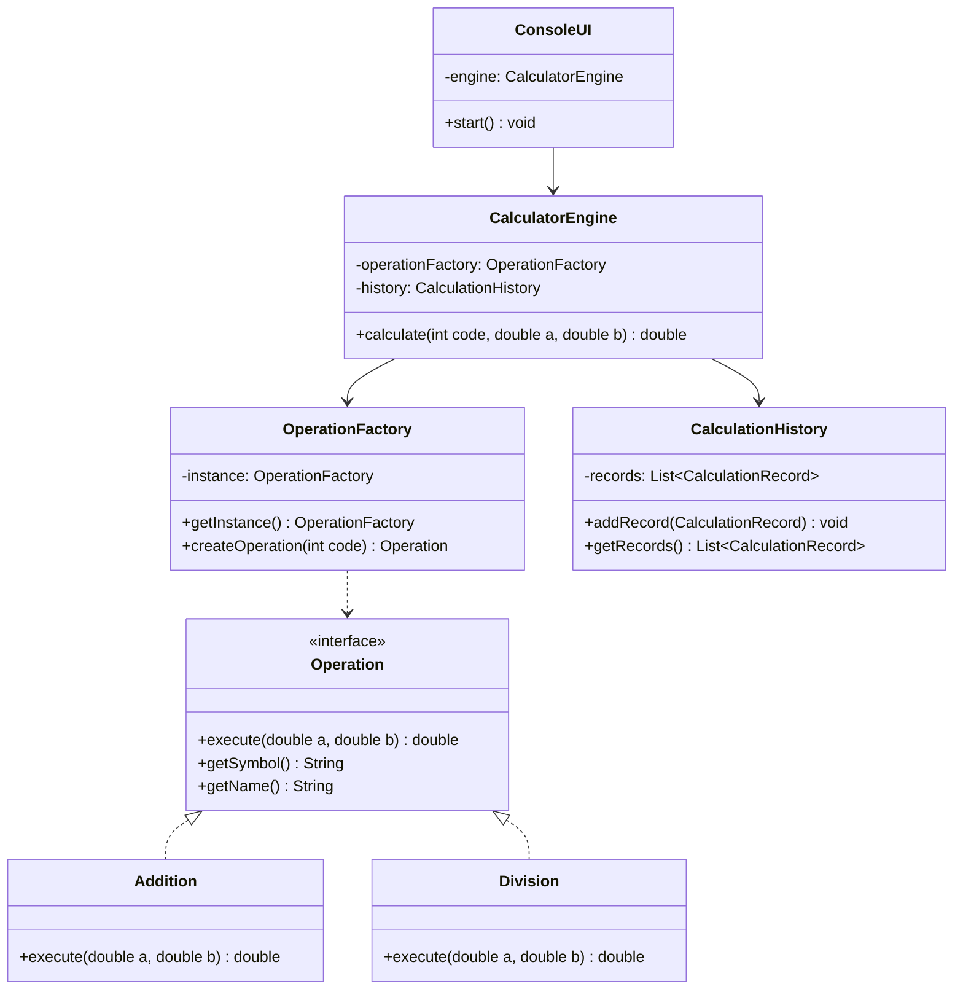

# 🧮 Console Calculator - Enterprise Java Application


> **Enterprise-grade console calculator application showcasing professional Java development practices, design patterns, comprehensive testing, and modern DevOps workflows.**

Built as a portfolio project to demonstrate proficiency in **Java Backend Development** for job applications and technical interviews.

---

## 📸 Application Screenshots

````carousel

<!-- slide -->

<!-- slide -->

<!-- slide -->

<!-- slide -->

<!-- slide -->

<!-- slide -->

````

---

## 📌 Table of Contents

- [Features](#-features)
- [Technical Highlights](#-technical-highlights)
- [Architecture](#-architecture)
- [Getting Started](#-getting-started)
- [Usage](#-usage)
- [Testing](#-testing)
- [Project Structure](#-project-structure)
- [Design Patterns](#-design-patterns)
- [Code Quality](#-code-quality)
- [Contributing](#-contributing)
- [License](#-license)

---

## ✨ Features

### Basic Operations
- ➕ **Addition** - Add two numbers
- ➖ **Subtraction** - Subtract two numbers
- ✖️ **Multiplication** - Multiply two numbers
- ➗ **Division** - Divide with zero-division protection

### Advanced Operations
- 📐 **Power** - Calculate a^b
- √ **Square Root** - Calculate √a with negative number validation
- % **Modulus** - Calculate remainder (a % b)
- 💯 **Percentage** - Calculate b% of a

### Scientific Operations
- 📊 **Trigonometry** - sin, cos, tan (degrees input)
- 📊 **Logarithm** - Natural logarithm (ln)

### Additional Features
- 📝 **Calculation History** - Automatic recording with timestamps
- 🗑️ **History Management** - View and clear history
- ⚡ **Performance Tracking** - Execution time measurement
- 🔒 **Robust Error Handling** - Comprehensive exception management
- 📋 **Professional Logging** - SLF4J + Logback integration

---

## 🎯 Technical Highlights

This project demonstrates professional-level Java development skills required for **Backend Developer** and **Full-Stack Java Developer** positions:

### Core Java Skills
- ✅ **OOP Principles** - Encapsulation, Inheritance, Polymorphism, Abstraction
- ✅ **SOLID Principles** - Single Responsibility, Open/Closed, Liskov Substitution, Interface Segregation, Dependency Inversion
- ✅ **Java 17 Features** - Records, Pattern Matching, Enhanced Switch
- ✅ **Collections Framework** - Lists, Maps, proper usage and performance awareness
- ✅ **Generics** - Type-safe code implementation
- ✅ **Exception Handling** - Custom exception hierarchy with proper error handling

### Design Patterns
- 🎨 **Strategy Pattern** - Operation interface for interchangeable algorithms
- 🎨 **Factory Pattern** - Centralized operation creation (OperationFactory)
- 🎨 **Singleton Pattern** - Single factory instance management
- 🎨 **Builder Pattern** - (Planned for complex calculations)

### Testing & Quality
- 🧪 **JUnit 5** - Modern testing framework with extensive test coverage
- 🧪 **Mockito** - Mocking framework for isolated unit tests
- 🧪 **AssertJ** - Fluent assertion library for readable tests
- 🧪 **Parameterized Tests** - Data-driven testing approach
- 🧪 **Test Coverage** - JaCoCo integration (Target: 90%+)

### Build & DevOps
- 🔧 **Maven** - Dependency management and build automation
- 🔧 **Maven Profiles** - Environment-specific configurations (dev, test, prod)
- 🔧 **Code Quality Tools** - Checkstyle, SpotBugs, PMD integration
- 🔧 **Logging** - SLF4J API with Logback implementation
- 🔧 **Configuration Management** - Properties-based configuration

### Best Practices
- 📚 **JavaDoc** - Comprehensive code documentation
- 📚 **Clean Code** - Meaningful names, small functions, DRY principle
- 📚 **Code Style** - Consistent formatting and naming conventions
- 📚 **Version Control** - Git with semantic commits
- 📚 **Separation of Concerns** - Layered architecture (UI, Business Logic, Data)

---

## 🏗️ Architecture

### High-Level Architecture

```
┌─────────────────────────────────────────────────┐
│              Presentation Layer                 │
│                  (ConsoleUI)                    │
└──────────────────┬──────────────────────────────┘
                   │
┌──────────────────▼──────────────────────────────┐
│              Business Logic Layer               │
│             (CalculatorEngine)                  │
│  ┌──────────────────────────────────────┐      │
│  │    OperationFactory (Singleton)      │      │
│  └──────────────────────────────────────┘      │
└──────────────────┬──────────────────────────────┘
                   │
┌──────────────────▼──────────────────────────────┐
│               Data Layer                        │
│          (CalculationHistory)                   │
└─────────────────────────────────────────────────┘
```

### Class Diagram



---

## 🚀 Getting Started

### Prerequisites

- **Java 17** or higher ([Download](https://adoptium.net/))
- **Maven 3.8+** ([Download](https://maven.apache.org/download.cgi))
- **Git** (for cloning the repository)

### Installation

1. **Clone the repository**
   ```bash
   git clone https://github.com/yourusername/console-calculator.git
   cd console-calculator
   ```

2. **Build the project**
   ```bash
   mvn clean install
   ```

3. **Run the application**
   ```bash
   # Option 1: Using Maven
   mvn exec:java -Dexec.mainClass="com.learning.calculator.Calculator"
   
   # Option 2: Using JAR
   java -jar target/console-calculator-1.0.0.jar
   ```

### Quick Start (No Maven)

If you have an IDE like IntelliJ IDEA or Eclipse:

1. Import the project as a Maven project
2. Let the IDE download dependencies
3. Run `Calculator.java` main class

---

## 💻 Usage

### Basic Calculation

```
╔══════════════════════════════════════════════════════════╗
║                        MAIN MENU                         ║
╠══════════════════════════════════════════════════════════╣
║  BASIC OPERATIONS                                        ║
║    1. ➕ Addition                                         ║
║    2. ➖ Subtraction                                      ║
║    3. ✖️  Multiplication                                  ║
║    4. ➗ Division                                         ║
╚══════════════════════════════════════════════════════════╝

👉 Enter your choice: 1

📊 Enter first number: 10
📊 Enter second number: 5

────────────────────────────────────────────────────────────
✅ RESULT
────────────────────────────────────────────────────────────
Addition: 10.0000 + 5.0000 = 15.0000 (executed in 0.234 ms)
────────────────────────────────────────────────────────────
```

### View History

```
👉 Enter your choice: 20

════════════════════════════════════════════════════════════════════════════════
                         CALCULATION HISTORY
════════════════════════════════════════════════════════════════════════════════
[2026-01-28 19:45:23] Addition: 10.0000 + 5.0000 = 15.0000
[2026-01-28 19:45:45] Division: 20.0000 / 4.0000 = 5.0000
[2026-01-28 19:46:12] Power: 2.0000 ^ 10.0000 = 1024.0000
════════════════════════════════════════════════════════════════════════════════
Total: 3 calculation(s)
════════════════════════════════════════════════════════════════════════════════
```

---

## 🧪 Testing

This project includes comprehensive unit and integration tests demonstrating professional testing practices.

### Run All Tests

```bash
mvn test
```

### Generate Test Coverage Report

```bash
mvn jacoco:report
```

The coverage report will be generated in `target/site/jacoco/index.html`

### Test Categories

- **Unit Tests** - Individual component testing (Operation classes, Engine, History)
- **Integration Tests** - Component interaction testing
- **Parameterized Tests** - Data-driven testing with multiple inputs
- **Exception Tests** - Error handling verification

### Test Coverage Goals

- **Target**: 90%+ line coverage
- **Current**: _Will be measured after first test run_

---

## 📂 Project Structure

```
console-calculator/
├── src/
│   ├── main/
│   │   ├── java/com/learning/calculator/
│   │   │   ├── Calculator.java                 # Main entry point
│   │   │   ├── core/
│   │   │   │   └── CalculatorEngine.java       # Business logic
│   │   │   ├── operations/
│   │   │   │   ├── Operation.java              # Strategy interface
│   │   │   │   ├── basic/                      # Basic operations
│   │   │   │   ├── advanced/                   # Advanced operations
│   │   │   │   ├── scientific/                 # Scientific operations
│   │   │   │   └── factory/
│   │   │   │       └── OperationFactory.java   # Factory pattern
│   │   │   ├── history/
│   │   │   │   ├── CalculationHistory.java
│   │   │   │   └── CalculationRecord.java
│   │   │   ├── ui/
│   │   │   │   └── ConsoleUI.java              # User interface
│   │   │   └── exceptions/                     # Custom exceptions
│   │   └── resources/
│   │       ├── logback.xml                     # Logging config
│   │       └── application.properties          # App config
│   └── test/
│       └── java/com/learning/calculator/       # Test cases
├── pom.xml                                     # Maven configuration
├── checkstyle.xml                              # Code style rules
├── .gitignore                                  # Git ignore rules
└── README.md                                   # This file
```

---

## 🎨 Design Patterns

### 1. Strategy Pattern
**Location**: `Operation` interface and implementations

**Purpose**: Encapsulate calculation algorithms to make them interchangeable

**Benefits**:
- Easy to add new operations without modifying existing code
- Each operation is isolated and testable
- Follows Open/Closed Principle

### 2. Factory Pattern
**Location**: `OperationFactory` class

**Purpose**: Centralize object creation logic

**Benefits**:
- Single point of operation creation
- Easy to extend with new operations
- Decouples creation from usage

### 3. Singleton Pattern
**Location**: `OperationFactory.getInstance()`

**Purpose**: Ensure only one factory instance exists

**Benefits**:
- Controlled access to single instance
- Reduced memory footprint
- Global point of access

---

## 📊 Code Quality

### Static Analysis Tools

```bash
# Checkstyle - Code style verification
mvn checkstyle:check

# SpotBugs - Bug detection
mvn spotbugs:check

# PMD - Static code analysis
mvn pmd:check
```

### Code Quality Metrics

| Metric | Target | Tool |
|--------|--------|------|
| Test Coverage | 90%+ | JaCoCo |
| Code Style | 0 violations | Checkstyle |
| Bugs | 0 critical | SpotBugs |
| Code Smells | Minimal | PMD |

---

## 🤝 Contributing

Contributions are welcome! This is a learning project, so feel free to:

1. Fork the repository
2. Create a feature branch (`git checkout -b feature/AmazingFeature`)
3. Commit your changes (`git commit -m 'Add some AmazingFeature'`)
4. Push to the branch (`git push origin feature/AmazingFeature`)
5. Open a Pull Request

Please ensure:
- ✅ All tests pass (`mvn test`)
- ✅ Code follows style guidelines (`mvn checkstyle:check`)
- ✅ New features include tests
- ✅ JavaDoc is updated for public APIs

---

## 📄 License

This project is licensed under the MIT License - see the [LICENSE](LICENSE) file for details.

---

## 👨‍💻 Author

**[Your Name]**

- 🌐 Portfolio: [your-portfolio.com](https://your-portfolio.com)
- 💼 LinkedIn: [linkedin.com/in/yourprofile](https://linkedin.com/in/yourprofile)
- 📧 Email: your.email@example.com
- 🐙 GitHub: [@yourusername](https://github.com/yourusername)

---

## 🎓 Learning Outcomes

This project was built to demonstrate proficiency in:

- ✅ Java 17 and modern Java features
- ✅ Object-Oriented Programming and SOLID principles
- ✅ Design Patterns (Strategy, Factory, Singleton)
- ✅ Unit Testing with JUnit 5 and Mockito
- ✅ Maven build automation and dependency management
- ✅ Code quality tools and best practices
- ✅ Professional logging with SLF4J and Logback
- ✅ Clean Code principles and maintainable architecture
- ✅ Git version control and professional documentation

---

## 🚀 Future Enhancements

- [ ] Expression Parser (e.g., "5 + 3 * 2")
- [ ] Persistent history (JSON/CSV storage)
- [ ] GUI version with JavaFX
- [ ] REST API with Spring Boot
- [ ] Number system conversion (Binary, Hex, Octal)
- [ ] Memory functions (M+, M-, MR, MC)
- [ ] CI/CD pipeline with GitHub Actions
- [ ] Docker containerization
- [ ] SonarCloud integration

---

<div align="center">

**⭐ If you find this project helpful, please give it a star! ⭐**

Made with ❤️ for learning and professional development

</div>
