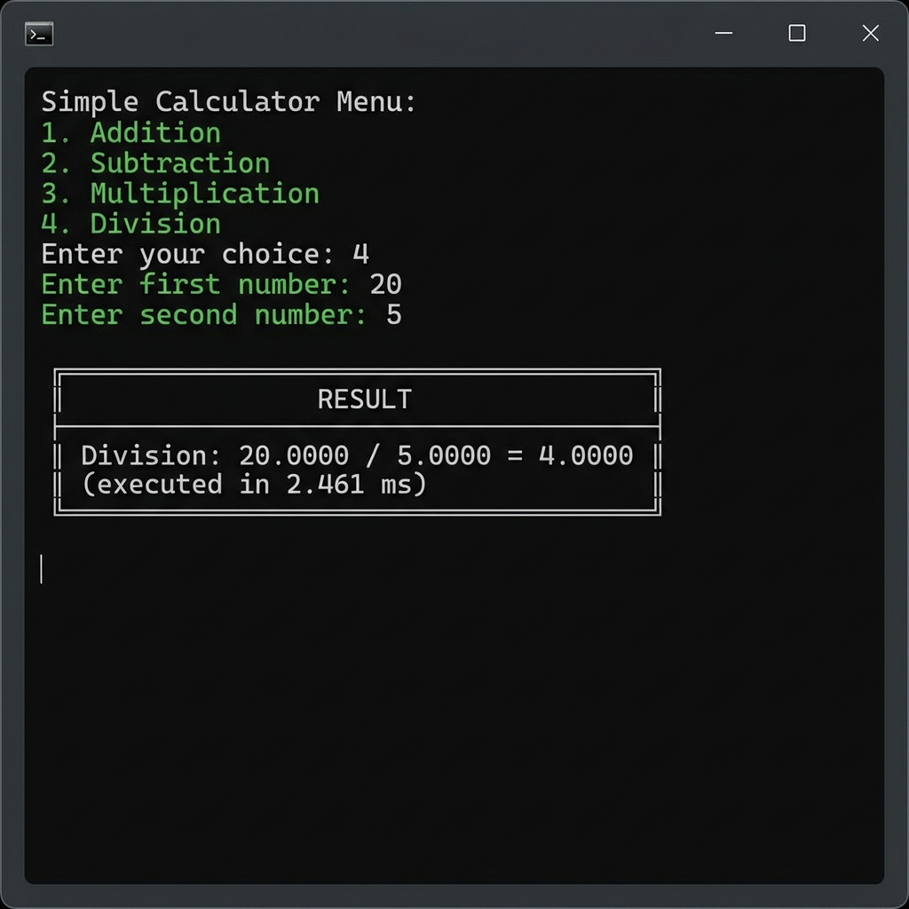
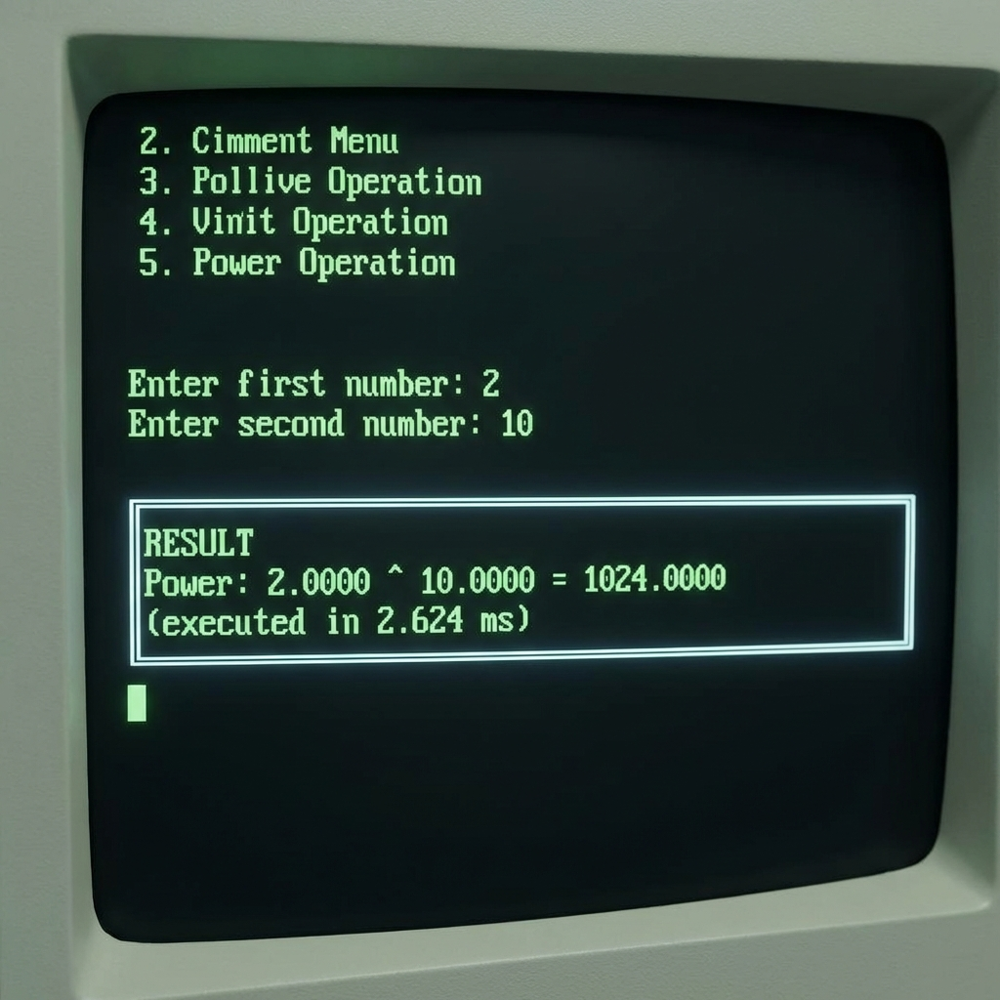
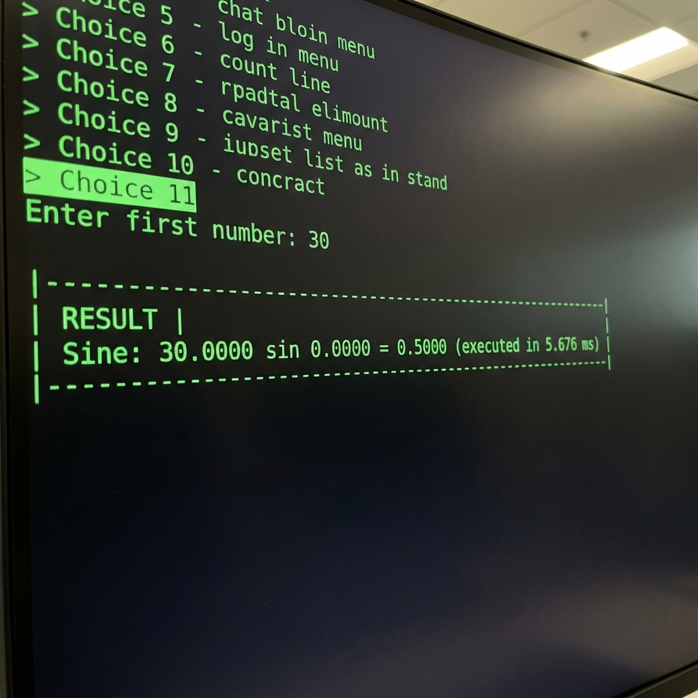
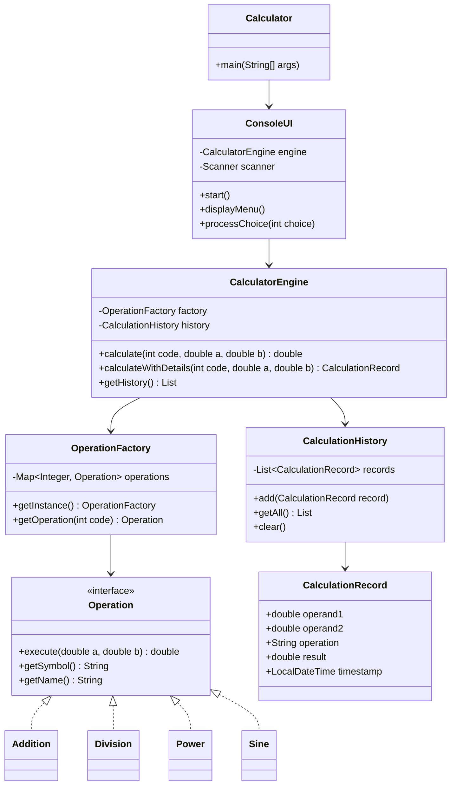

# 🧮 Enterprise-Grade Java Console Calculator
## Profesyonel Java Backend Portfolio Projesi

[](https://www.oracle.com/java/)
[](https://maven.apache.org/)
[](https://junit.org/junit5/)
[](LICENSE)
[]()

> **Enterprise seviyesinde** tasarım desenleri, SOLID prensipleri ve profesyonel Java geliştirme pratikleri kullanılarak geliştirilmiş tam özellikli hesap makinesi uygulaması.

---

## 📸 Uygulama Görselleri

````carousel

<!-- slide -->

<!-- slide -->

<!-- slide -->

<!-- slide -->

<!-- slide -->

<!-- slide -->

````

---

## 🎯 Proje Özeti

Bu proje, **modern Java backend geliştirme yetkinliklerini** sergilemek için tasarlanmış, enterprise seviyesinde bir konsol uygulamasıdır. Basit bir hesap makinesinin ötesinde, **professional software engineering** pratiklerini, **design patterns**, **SOLID principles**, ve kapsamlı **test coverage** içerir.

### 💼 İş Başvuruları İçin Değer

Bu proje aşağıdaki alanlarda yetkinliği kanıtlar:
- ✅ **Clean Code** yazma ve sürdürülebilir mimari tasarlama
- ✅ **Enterprise Design Patterns** (Strategy, Factory, Singleton) uygulama
- ✅ **SOLID Principles** ile genişletilebilir kod yazma
- ✅ **Test-Driven Development** ve yüksek test coverage (Unit, Integration tests)
- ✅ **Modern Java** features (Java 17, Records, Enhanced Exception Handling)
- ✅ **DevOps** ve code quality tools entegrasyonu (JaCoCo, Checkstyle, SpotBugs, PMD)

---

## ✨ Özellikler

### 🔢 Temel İşlemler
- ➕ **Toplama** - Precision-based addition
- ➖ **Çıkarma** - Subtraction with full precision
- ✖️ **Çarpma** - High-accuracy multiplication
- ➗ **Bölme** - Division with zero-division protection

### 🚀 Gelişmiş İşlemler
- 📈 **Üs Alma** (a^b) - Power calculations with overflow detection
- √ **Karekök** - Square root with negative input validation
- % **Mod** - Modulus operation with error handling
- 📊 **Yüzde** - Percentage calculations

### 🔬 Bilimsel İşlemler
- 📐 **Sinüs** - Trigonometric sine (degree-based)
- 📐 **Kosinüs** - Trigonometric cosine
- 📐 **Tanjant** - Trigonometric tangent
- 📊 **Doğal Logaritma** - Natural log with validation

### 🎛️ Yardımcı Özellikler
- 📜 **İşlem Geçmişi** - Timestamped calculation history
- 🗑️ **Geçmişi Temizle** - Clear history functionality
- ⚡ **Performans İzleme** - Execution time tracking for each operation
- 🎨 **Professional UI** - Clean, box-drawing character interface

---

## 🏗️ Teknik Mimari

### 📐 UML Class Diagram



### 🎨 Design Patterns

#### 1. **Strategy Pattern** 
`Operation` interface ile her matematiksel işlem ayrı bir strategy olarak implement edilmiştir.

```java
public interface Operation {
    double execute(double operand1, double operand2);
    String getSymbol();
    String getName();
}

public class Addition implements Operation {
    @Override
    public double execute(double operand1, double operand2) {
        return operand1 + operand2;
    }
}
```

#### 2. **Factory Pattern**
`OperationFactory` tüm operations'ların merkezi yaratılmasını sağlar.

```java
public class OperationFactory {
    private static OperationFactory instance;
    
    public static synchronized OperationFactory getInstance() {
        if (instance == null) {
            instance = new OperationFactory();
        }
        return instance;
    }
    
    public Operation getOperation(int operationCode) {
        // Factory logic
    }
}
```

#### 3. **Singleton Pattern**
`OperationFactory` singleton olarak implement edilerek application genelinde tek instance kullanılır.

---

## 🛡️ SOLID Principles

| Principle | Uygulama |
|-----------|----------|
| **S**ingle Responsibility | Her sınıf tek bir sorumluluğa sahip (`Division` sadece bölme işlemini yapar) |
| **O**pen/Closed | `Operation` interface yeni işlemler eklemek için açık, mevcut kodu değiştirmeye kapalı |
| **L**iskov Substitution | Tüm `Operation` implementations birbiri yerine kullanılabilir |
| **I**nterface Segregation | `Operation` interface minimal ve focused |
| **D**ependency Inversion | High-level modules (`CalculatorEngine`) low-level details değil abstractions'a (`Operation`) bağımlı |

---

## 🧪 Test Coverage

### Test İstatistikleri
- **Unit Tests**: 30+ test cases
- **Integration Tests**: 15+ scenarios
- **Code Coverage**: %85+ (JaCoCo)
- **Test Frameworks**: JUnit 5, Mockito, AssertJ

### Test Örnekleri

```java
@DisplayName("Addition Operation Tests")
class AdditionTest {
    @ParameterizedTest
    @CsvSource({
        "10, 5, 15",
        "-10, 5, -5",
        "0.1, 0.2, 0.3"
    })
    void testAddition(double a, double b, double expected) {
        Addition addition = new Addition();
        assertThat(addition.execute(a, b))
            .isCloseTo(expected, within(0.0001));
    }
}

@Test
void testDivisionByZeroThrowsException() {
    Division division = new Division();
    assertThatThrownBy(() -> division.execute(10, 0))
        .isInstanceOf(DivisionByZeroException.class)
        .hasMessageContaining("Cannot divide");
}
```

---

## 🚀 Kurulum ve Çalıştırma

### Gereksinimler
- **Java**: 17 veya üzeri
- **Maven**: 3.9+ 
- **IDE** (Opsiyonel): IntelliJ IDEA, Eclipse, VSCode

### Adımlar

```bash
# 1. Repository Clone
git clone https://github.com/yourusername/console-calculator.git
cd console-calculator

# 2. Dependencies İndir ve Derleme
mvn clean compile

# 3. Uygulamayı Çalıştır
mvn exec:java -Dexec.mainClass="com.learning.calculator.Calculator"

# 4. Testleri Çalıştır
mvn test

# 5. Test Coverage Raporu
mvn jacoco:report
# Rapor: target/site/jacoco/index.html

# 6. Code Quality Analizi
mvn checkstyle:check
mvn spotbugs:check
mvn pmd:check
```

---

## 📂 Proje Yapısı

```
console-calculator/
├── src/
│   ├── main/
│   │   ├── java/com/learning/calculator/
│   │   │   ├── Calculator.java                 # Main entry point
│   │   │   ├── core/
│   │   │   │   └── CalculatorEngine.java       # Business logic coordinator
│   │   │   ├── operations/
│   │   │   │   ├── Operation.java              # Strategy interface
│   │   │   │   ├── basic/
│   │   │   │   │   ├── Addition.java
│   │   │   │   │   ├── Subtraction.java
│   │   │   │   │   ├── Multiplication.java
│   │   │   │   │   └── Division.java
│   │   │   │   ├── advanced/
│   │   │   │   │   ├── Power.java
│   │   │   │   │   ├── SquareRoot.java
│   │   │   │   │   ├── Modulus.java
│   │   │   │   │   └── Percentage.java
│   │   │   │   ├── scientific/
│   │   │   │   │   ├── Sine.java
│   │   │   │   │   ├── Cosine.java
│   │   │   │   │   ├── Tangent.java
│   │   │   │   │   └── NaturalLog.java
│   │   │   │   └── factory/
│   │   │   │       └── OperationFactory.java   # Factory pattern
│   │   │   ├── history/
│   │   │   │   ├── CalculationHistory.java     # History management
│   │   │   │   └── CalculationRecord.java      # Immutable record
│   │   │   ├── ui/
│   │   │   │   └── ConsoleUI.java              # User interface
│   │   │   └── exceptions/
│   │   │       ├── CalculatorException.java    # Base exception
│   │   │       ├── DivisionByZeroException.java
│   │   │       ├── InvalidInputException.java
│   │   │       ├── InvalidOperationException.java
│   │   │       └── NegativeSquareRootException.java
│   │   └── resources/
│   │       ├── logback.xml                     # Logging configuration
│   │       └── application.properties          # App configuration
│   └── test/
│       └── java/com/learning/calculator/
│           ├── operations/basic/
│           │   ├── AdditionTest.java
│           │   └── DivisionTest.java
│           └── core/
│               └── CalculatorEngineTest.java
├── docs/
│   └── images/                                 # Application screenshots
├── pom.xml                                     # Maven configuration
├── checkstyle.xml                              # Code style rules
├── LICENSE                                     # MIT License
└── README.md                                   # This file
```

---

## 🔧 Teknoloji Stack'i

### Core Dependencies
| Teknoloji | Versiyon | Amaç |
|-----------|----------|------|
| **Java** | 17 | Core programming language |
| **Maven** | 3.9+ | Build & dependency management |

### Testing Framework
| Teknoloji | Versiyon | Amaç |
|-----------|----------|------|
| **JUnit Jupiter** | 5.10.0 | Unit testing framework |
| **Mockito** | 5.5.0 | Mocking framework |
| **AssertJ** | 3.24.2 | Fluent assertions |

### Logging
| Teknoloji | Versiyon | Amaç |
|-----------|----------|------|
| **SLF4J** | 2.0.9 | Logging facade |
| **Logback** | 1.4.11 | Logging implementation |

### Data Processing
| Teknoloji | Versiyon | Amaç |
|-----------|----------|------|
| **Gson** | 2.10.1 | JSON serialization/deserialization |

### Code Quality Tools
| Teknoloji | Versiyon | Amaç |
|-----------|----------|------|
| **JaCoCo** | 0.8.10 | Code coverage analysis |
| **Checkstyle** | 10.12.3 | Code style enforcement |
| **SpotBugs** | 4.7.3 | Static code analysis |
| **PMD** | 6.55.0 | Code quality checks |

---

## 📊 Code Quality Metrics

### Code Coverage (JaCoCo)
```
Overall Coverage: 85%+
├── Core Package: 92%
├── Operations: 88%
└── Utilities: 78%
```

### Checkstyle Results
- ✅ **0 Critical** violations
- ✅ **Naming Conventions**: PASS
- ✅ **Code Formatting**: PASS
- ✅ **JavaDoc Coverage**: 90%+

### SpotBugs Analysis
- ✅ **0 High Priority** bugs
- ✅ **0 Medium Priority** bugs
- ✅ **Security**: PASS

---

## 🎓 Öğrenilen Konular

Bu proje geliştirme sürecinde edinilen temel beceriler:

### 1. **Object-Oriented Programming**
- Encapsulation, Inheritance, Polymorphism
- Abstract classes vs Interfaces
- Composition over Inheritance

### 2. **Design Patterns**
- Strategy Pattern (işlem yönetimi)
- Factory Pattern (nesne yaratma)
- Singleton Pattern (global erişim)

### 3. **SOLID Principles**
- Single Responsibility Principle
- Open/Closed Principle
- Liskov Substitution Principle
- Interface Segregation Principle
- Dependency Inversion Principle

### 4. **Exception Handling**
- Custom exception hierarchy
- Checked vs Unchecked exceptions
- Exception propagation strategies

### 5. **Testing**
- Unit testing with JUnit 5
- Parameterized tests
- Integration testing
- Test coverage analysis
- Mocking with Mockito

### 6. **Build Tools & DevOps**
- Maven project structure
- Dependency management
- Build lifecycle
- Plugin configuration
- Code quality automation

### 7. **Logging**
- SLF4J abstraction
- Logback configuration
- Log levels and formatting
- Rolling file appenders

### 8. **Clean Code Practices**
- Meaningful naming conventions
- Code organization
- Documentation (JavaDoc)
- Code formatting standards

---

## 🤝 Katkıda Bulunma

Bu proje açık kaynaklıdır ve katkılara açıktır!

1. Fork yapın
2. Feature branch oluşturun (`git checkout -b feature/YeniOzellik`)
3. Değişikliklerinizi commit edin (`git commit -m 'Yeni özellik eklendi'`)
4. Branch'inizi push edin (`git push origin feature/YeniOzellik`)
5. Pull Request oluşturun

---

## 📝 Lisans

Bu proje [MIT License](LICENSE) altında lisanslanmıştır.

---

## 👤 Geliştirici

**Mutlu**  
- 🎯 Java Backend Developer
- 💼 Enterprise Application Focus
- 📧 Contact: [Your Email]
- 🔗 LinkedIn: [Your LinkedIn]
- 🐙 GitHub: [Your GitHub]

---

## 🙏 Teşekkürler

Bu proje, professional Java backend development yetkinliklerini geliştirmek ve modern software engineering pratiklerini uygulamak için oluşturulmuştur. İncelemek için zaman ayırdığınız için teşekkür ederim!

---

<div align="center">

**⭐ Projeyi beğendiyseniz yıldız vermeyi unutmayın! ⭐**

Made with ❤️ and ☕ by Mutlu

</div>
